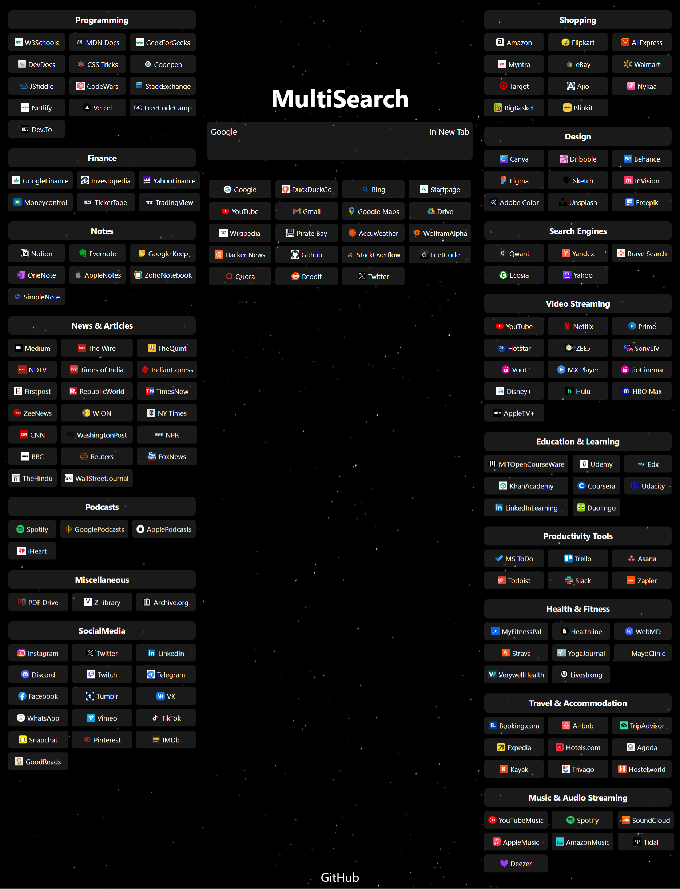

# MultiSearch



Deployed Link [https://multisearch0.netlify.app/](https://multisearch0.netlify.app/)

MultiSearch is a web application that allows users to search multiple websites (100+) from a single website or on some website you can't search so it opens them in one click

## To Run It Locally

1. Clone the repository:

   ```sh
   git clone https://github.com/s54a/MultiSearch.git
   ```

2. Install dependencies:

   ```sh
   npm install
   ```

3. Start the application:
   ```sh
   npm run dev
   ```

## Usage

- Enter your search query in the input field.
- Press Enter to Search on Google or Click on the Search Engine or Website on which you want to search upon.
- Or if you just focus the search box and press enter it will open Google

## Contributing

Contributions are welcome! Please submit pull requests to contribute.

## License

This project is licensed under the [MIT License](LICENSE).

Feel free to customize it further based on your project's specific needs and features.
